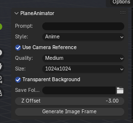

# PlaneAnimator
Only avalibale for Windows but adding mac version soon*

**"What can you do with this add on?"**  
Quickly create transparent (or opaque) images from prompts or camera reference using the annotation tool

---

## ⚙️ How It Works

PlaneAnimator connects Blender to a local Flask server, which talks to OpenAI’s image generation API (`gpt-image-1`). You describe what you want, and the system inserts a styled image plane right into your 3D scene.

---

## 🧩 Features

- One-click image plane generation from a prompt
- Choose between Anime, Realism, or Cartoon styles
- Optional camera reference screenshot
- Transparent or solid backgrounds
- Auto-inserts the image as a material with emission & alpha blending
- Saves all outputs to your selected folder

---

## 📸 UI Overview

### 1. Add-on Panel in Blender

> Select the style, prompt, and folder. Click **Generate**.



---

### 2. Example Output with Transparent Background

> Generated image plane from prompt only.


---

### 3. Example Using Camera Reference

> A reference screenshot was used to guide the image generation.


---

## 🚀 Getting Started

### 1. Download & Install

- Clone this repo or download it as a ZIP
- Navigate to the `server/` folder and install the Flask dependencies:

```bash
cd server
python -m venv venv
venv\Scripts\activate      # On Windows
pip install -r requirements.txt
