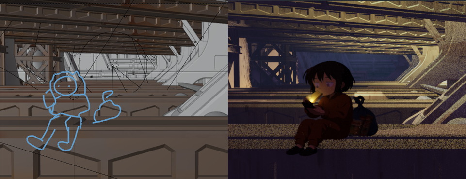

# PlaneAnimator
Only avalibale for Blender 3.2+ & Windows*

**"What can you do with this add on?"**  
Quickly create transparent (or opaque) images from prompts or camera reference using the annotation tool

---

## ⚙️ How It Works

PlaneAnimator connects Blender to a local Flask server, which talks to OpenAI’s image generation API (`gpt-image-1`). You describe what you want, and the system inserts a styled image plane right into your 3D scene.

---

## 🧩 Features

- One-click image plane generation from a prompt
- Choose between Anime, Realism, or Cartoon styles
- Optional camera reference screenshot
- Transparent or solid backgrounds
- Auto-inserts the image as a material with emission & alpha blending
- Saves all outputs to your selected folder

---

## 📸 UI Overview

### 1. Add-on Panel in Blender

> Select the style, prompt, and folder. Click **Generate**.


---

### 2. Example Output with Transparent Background

> Generated image plane from prompt only.


---

### 3. Example Using Camera Reference

> A reference screenshot was used to guide the image generation.



---

## 🚀 Getting Started

### 1. Download & Set Up the Server

- Clone this repo or download it as a ZIP
- Navigate to the `server/` folder and install the Flask dependencies:

```bash
cd server
python -m venv venv
venv\Scripts\activate      # On Windows
pip install -r requirements.txt
```

- Create a `.env` file (you can copy from `.env.example`) and insert your OpenAI API key:

```env
OPENAI_API_KEY=sk-xxxxxxxxxxxxxxxxxxxxxxxxxxxx
```

> 🔑 You’ll need a valid OpenAI API key with access to **image generation** (`gpt-image-1`).  
[Request access here](https://platform.openai.com/docs/guides/images-vision?api-mode=responses)

---

### 2. Install the Blender Add-on

- Open Blender **3.2 or higher**
- Go to **Edit > Preferences > Add-ons**
- Click **Install...**
- **Drag and drop the zipped `blender_addon` folder** into the file browser window, or manually select the `.zip`
- Enable the checkbox next to **PlaneAnimator** to activate the add-on

---

## 🧪 Usage

1. Type in a prompt (e.g., *“ghost girl with umbrella”*)
2. Pick a style and output folder
3. (Optional) Check **Use Camera Reference** if you want the current camera view as a guide
4. Click **Generate Frame**
5. Done! The image plane will appear in front of the camera with the image applied.

---
